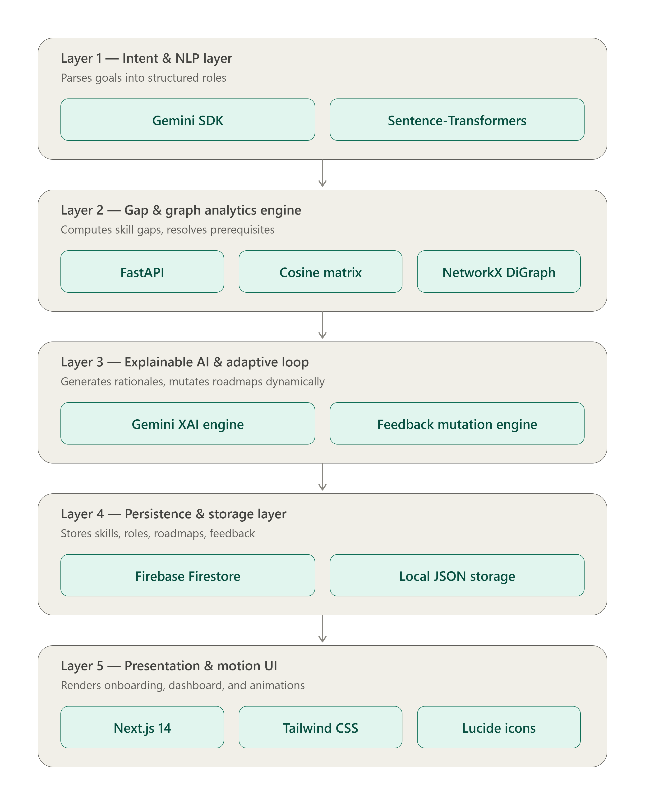
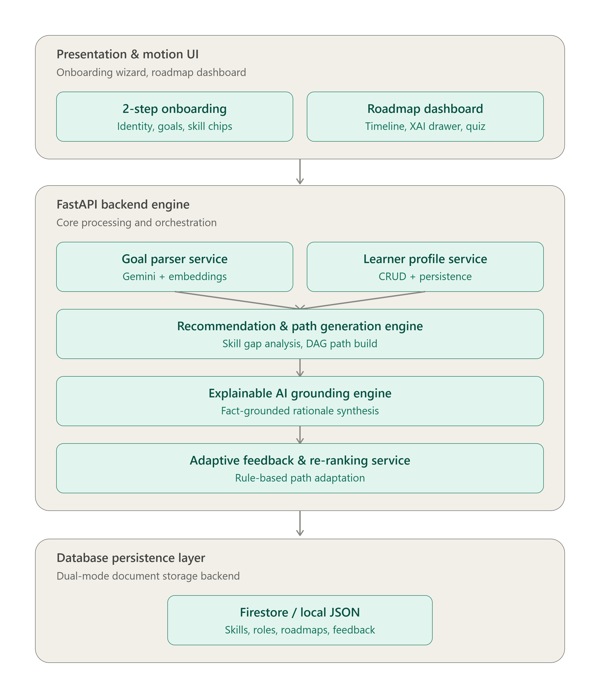

# Skillo AI

## An AI-driven career learning platform built with Next.js and FastAPI that uses vector gap analysis and prerequisite graphs for real-time adaptive feedback

> Static learning roadmaps show you where to go. Skillo AI maps your existing skills, charts a prerequisite-respecting path, and dynamically adapts in real time even when you fail an assessment.

---

## Executive Summary

In today's fast-evolving technology landscape, self-directed learners and software engineers struggle to navigate the vast sea of online courses, tutorials, and certifications. Standard search engines and course catalogs return flat keyword matches without understanding a learner's existing competencies or the strict prerequisite dependencies required for production-ready mastery.

**Skillo AI** addresses this problem by acting as an intelligent career learning accelerator. Given a learner's current skillset and an unformatted, natural-language career aspiration (e.g., *"I know HTML, CSS, and basic Python and want to build backend server systems with databases and REST APIs"*), Skillo AI:

1. **Extracts Intent**: Translates free-text objectives into structured target roles using the official Google GenAI Gemini SDK (`google-genai`), backed by a zero-API-key local sentence-transformer embedding model (`all-MiniLM-L6-v2`).
2. **Computes Skill Gap Vectors**: Performs dense semantic similarity comparison (tau = 0.60) between stated skills and target role requirements, correctly distinguishing skill depth (e.g., `Python (basic)` vs `Python (advanced)`).
3. **Generates Prerequisite-Respecting DAG Paths**: Constructs a Directed Acyclic Graph (DAG) of technical competencies, calculates transitive prerequisite closures, and orders nodes using NetworkX topological sorting.
4. **Delivers Fact-Grounded Explainable AI (XAI)**: Synthesizes plain-language mentor explanations for every milestone grounded strictly in graph topology, answering *"Why is this skill recommended at this step?"* without hallucination.
5. **Adapts via Real-Time Feedback Loops**: Intercepts quiz assessment results and completion events, dynamically inserting remedial refresher modules on low scores (<50%) or flagging downstream steps for skip-acceleration on top scores (>=90%).

Skillo AI is designed for two deployment tiers:
* **Individual Learner Mode**: Standalone career path accelerator for students, self-taught developers, and career switchers.
* **Institutional / Enterprise Upskilling**: Centralized skill gap assessment and curriculum planning across software engineering teams.

---

## The Problem

Traditional learning management systems and static online roadmaps suffer from four core limitations:

1. **Keyword Search Tunnel Vision**: Searching for "DevOps" or "Backend Developer" returns isolated tools (e.g., Docker, Kubernetes) without accounting for the underlying foundational prerequisites (Linux CLI, Networking, REST APIs, Git).
2. **Static One-Size-Fits-All Sequences**: Generic roadmaps assume every student starts from scratch, forcing experienced learners to repeat concepts they have already mastered.
3. **Black-Box AI Recommendations**: Automated platforms recommend courses without explaining *why* a specific module is placed at a specific point in the sequence, eroding user trust.
4. **Rigid Non-Adaptive Execution**: When a learner struggles with an assessment, traditional platforms simply mark the test as failed without adapting the curriculum to address the underlying conceptual gap.

Skillo AI solves all four problems through an end-to-end architecture that combines vector semantic matching, graph theory, grounded LLM synthesis, and real-time adaptive feedback.

---

## Key Features & Technical Contributions

- **Natural Language Intent Parsing**: Powered by the official Google GenAI SDK (`google.genai.Client`) using `gemini-flash-latest` / `gemini-2.5-flash`, with a local dense sentence-transformer fallback (`all-MiniLM-L6-v2`) that embeds query and role contexts into 384-dimensional space.
- **Semantic Skill Gap Vector Analysis**: Pairwise cosine similarity matrix calculations identifying mastered versus missing competencies. Clamps level distinctions (e.g. `Python (basic)` vs `Python (advanced)` similarity is clamped at 0.52) to prevent basic knowledge from falsely satisfying advanced requirements.
- **Prerequisite DAG Resolution**: NetworkX Directed Acyclic Graph (DAG) transitive closure computation. Automatically injects unstated prerequisite dependencies before topological sorting.
- **Fact-Grounded Explainable AI (XAI)**: Upstream prerequisite and downstream milestone fact extraction combined with zero-hallucination Gemini mentor rationales.
- **Adaptive Feedback Loop**: Real-time roadmap mutation engine:
  - **Score <50%**: Injects a targeted remedial refresher node immediately at index + 1.
  - **Score >=90%**: Flags downstream dependent steps as skippable/accelerated.
  - **Completion / Score 50--89%**: Advances active step pointer and persists progress.
- **Dual-Tier Database Persistence**: Live Firebase Firestore integration with transparent zero-config fallback to wear-leveled local JSON storage (`app/data/db_storage.json`). Lazy credential loading avoids gRPC initialization hangs during local development.
- **Modern Synchronized Motion UX**: 2-step onboarding wizard in a fixed-height card (`h-[340px]`), synchronized dual-panel viewport carousel (`w-[200%]`) with cubic-bezier transition, and an orbiting background tech constellation (`OrbitBackground.tsx`).

---

## System Architecture

Skillo AI is built on a modular five-layer architecture designed for high performance, strict separation of concerns, and offline resilience.

### Architectural Layer Breakdown

<div align="center">

| Layer | Primary Components | Key Edge & System Responsibilities |
|---|---|---|
| **1. Intent & NLP Layer** | Google GenAI Gemini SDK, Sentence-Transformers (`all-MiniLM-L6-v2`) | Parses natural-language career goals into structured target roles and competencies via LLM prompts or dense 384-dim cosine similarity. |
| **2. Gap & Graph Analytics Engine** | FastAPI, Cosine Matrix, NetworkX `DiGraph` | Computes skill gap vectors (tau = 0.60), resolves transitive prerequisite closure graphs, and executes topological sorting. |
| **3. Explainable AI & Adaptive Loop** | Fact-Grounded Gemini XAI Engine, Feedback Mutation Engine | Generates non-hallucinating mentor rationales from DAG facts and dynamically mutates roadmaps based on assessment scores. |
| **4. Persistence & Storage Layer** | Firebase Firestore, Local JSON Storage Engine | Handles dual-mode document storage for skills, roles, prerequisites, resources, learners, roadmaps, and feedback events. |
| **5. Presentation & Motion UI** | Next.js 14 App Router, Tailwind CSS, Lucide Icons | Renders 2-step onboarding wizard, synchronized dual-panel slide carousel (`w-[200%]`), interactive timeline, and orbiting background tech constellation. |

</div>

<p align="center">
  
  <br/>
  <em>Figure 1: End-to-end backend flow and service interaction architecture</em>
</p>

### System Telemetry Pipeline

<p align="center">
  
  <br/>
  <em>Figure 2: Multi-layer system telemetry and data processing pipeline</em>
</p>

---

## Database Architecture & Data Model

Skillo AI uses a structured document schema stored natively in Firebase Firestore or mirrored in `backend/app/data/db_storage.json`:

- `skills`: Skill metadata (`skill_id`, `name`, `category`, `description`, `embedding_vector`).
- `roles`: Career role taxonomy (`role_id`, `name`, `description`, `required_skills`).
- `prerequisites`: Directed dependency edges (`prereq_id`, `from_skill_id`, `to_skill_id`).
- `resources`: Curated learning content (`resource_id`, `skill_id`, `title`, `url`, `type`, `is_remedial`).
- `learners`: Learner profile documents (`learner_id`, `name`, `current_skills`, `target_role_id`).
- `roadmaps`: Generated learning paths (`learner_id`, `roadmap` steps array, `created_at`, `updated_at`).
- `feedback_events`: Audit log of adaptive assessment events (`event_id`, `learner_id`, `step`, `score`, `action_taken`).

---

## Step-by-Step Setup & Execution Instructions

### Prerequisites
- **Python 3.10+** (Python 3.11 recommended)
- **Node.js 18+** and **npm**

---

### Option A: Standard Local Setup (Recommended)

#### 1. Clone & Navigate
```bash
git clone https://github.com/harsh-space/skillo.git
cd skillo
```

#### 2. Backend Setup & Local Database Seeding
```bash
# 1. Create and activate a virtual environment
python -m venv venv
# On Windows:
venv\Scripts\activate
# On Linux/macOS:
source venv/bin/activate

# 2. Install backend dependencies
pip install -r backend/requirements.txt

# 3. Seed the initial dataset (34 skills, 5 roles, 35 DAG edges, 43 resources)
python scripts/seed_db.py

# 4. Run backend automated test suite
pytest backend/tests/test_backend.py -v

# 5. Start FastAPI backend server
python -m uvicorn backend.app.main:app --host 127.0.0.1 --port 8000 --reload
```
The FastAPI server will run at `http://127.0.0.1:8000`. Interactive OpenAPI documentation is accessible at `http://127.0.0.1:8000/docs`.

> **Environment Variables (Optional)**: Create a `.env` file in the root directory to enable Google Gemini AI or Firebase Firestore:
> ```env
> GEMINI_API_KEY=your_gemini_api_key_here
> GOOGLE_APPLICATION_CREDENTIALS=path/to/firebase_service_account.json
> ```
> *Note: If no API key is provided, Skillo AI transparently falls back to local dense vector embeddings and graph template rationales without throwing errors.*

#### 3. Frontend Setup
In a separate terminal:
```bash
cd frontend
npm install
npm run dev
```
Open [http://localhost:3000](http://localhost:3000) in your browser.

---

### Option B: Docker Container Deployment

```bash
docker build -t skillo-ai .
docker run -p 8000:8000 skillo-ai
```

---

## Validating the Worked Scenario

The application includes built-in preset configurations to reproduce the benchmark scenario:

1. **Onboarding**: Select **Persona A (Alex)** (`HTML, CSS, Python (basic)`) and input goal *"I want to become a backend developer"*.
2. **Goal Parsing**: Extracted target role is `Backend Developer` with target skills (`Python (advanced), SQL, REST APIs, Authentication, Git, Docker`).
3. **Gap Analysis**: Identifies missing competencies and flags `Python (advanced)` as a critical gap.
4. **Roadmap Generation**: Renders the strictly ordered DAG sequence:
   Python (advanced) -> SQL -> REST APIs -> Git -> Authentication -> Docker
5. **Grounded XAI**: Click **"Why this recommendation?"** on the `REST APIs` step:
   > *"Building on your Python (advanced) and SQL foundations, mastering REST APIs enables you to expose backend data services required for your Backend Developer goal. This unlocks subsequent modules in Authentication & JWT and containerized deployment with Docker."*
6. **Adaptive Re-Ranking**: Click **"Test Quiz & Adaptive Signal"** on Step 1 (`Python (advanced)`), choose **Score 40% (Fail)**:
   > A targeted **Remedial Refresher** node is dynamically injected immediately after Step 1 before advancing downstream.

---

## Repository Structure

```
.
├── backend/
│   ├── app/
│   │   ├── api/          # FastAPI routes (profile, goal, recommend, feedback, explain, taxonomy)
│   │   ├── services/     # Core engines (db, goal_parser, gap_analysis, path_generator, xai, feedback)
│   │   ├── models/       # Pydantic schemas (requests, responses, db models)
│   │   ├── data/         # Datasets & local storage (seed_skills, seed_roles, seed_prerequisites, db_storage.json)
│   │   └── main.py       # FastAPI app entry point & middleware configuration
│   ├── tests/            # Automated test suite (pytest)
│   ├── requirements.txt  # Python package specifications
│   └── README.md
├── frontend/
│   ├── app/              # Next.js 14 App router (page.tsx, layout.tsx, globals.css)
│   ├── components/       # UI components (GoalInput, Dashboard, RoadmapTimeline, QuizModal, XaiDrawer, SkillGraph, OrbitBackground)
│   ├── lib/              # API client & TypeScript interfaces
│   ├── package.json      # Node.js dependencies
│   └── README.md
├── docs/
│   ├── PRD.md            # Official HCLTech requirements & judging criteria
│   ├── context.md        # MVP scope, personas, and worked validation scenario
│   ├── architecture.md   # Technical architecture & API specifications
│   └── UNDER_THE_HOOD_V1.md # In-depth algorithmic breakdown
├── scripts/
│   └── seed_db.py        # Database seeding utility
├── Dockerfile            # Production container configuration
├── vercel.json           # Frontend Vercel configuration
└── README.md             # Top-level documentation
```

---

## Limitations & Future Scope

### Limitations
1. **Static Initial Taxonomy Scope**: Initial skill graph is focused on Software Development, DevOps, Full-Stack, and Data/ML roles. Adding new domain categories requires adding skill/prerequisite edges to the database.
2. **Rule-Based Adaptive Heuristics**: The adaptive feedback loop uses heuristic mutation rules (remedial insertion, skip flagging) as scoped in `context.md` rather than reinforcement learning trained on large student cohort data.
3. **Single-Learner Local State**: Local database storage handles single-learner sessions cleanly, while multi-tenant enterprise fleet management is designed for cloud Firestore deployment.

### Future Scope
1. **GitHub / LinkedIn Skill Verification**: Automatically extract a learner's existing skills by analyzing public GitHub repositories and commit histories.
2. **Cohort Reinforcement Learning**: Replace heuristic adaptation rules with an RL reward model trained on anonymized completion trajectories.
3. **Multi-Tenant Enterprise Upskilling Dashboard**: Provide engineering managers with aggregate team skill gap dashboards and organizational curriculum tracking.
